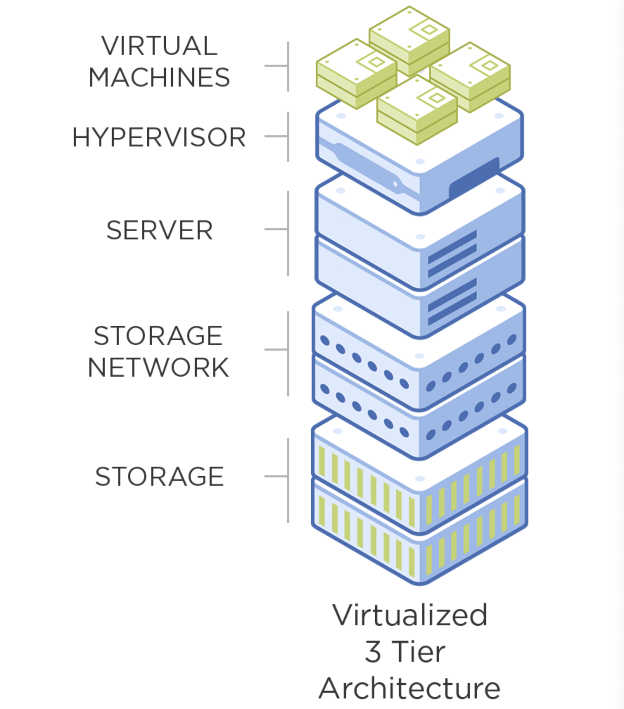

# Legacy IT: x86 Virtualization 
___

Both distributed computing and 3-tier systems exhibit flaws when required to operate at scale.

First, applications running on bare metal, on a commodity operating system, cannot effectively share resources with other applications. As a result, overall resource utilization remains low – typically at less than 20% over a server’s lifetime.

The answer to the resource utilization problem was virtualization.

**Virtualization** uses an abstraction layer and resource scheduler called a hypervisor to run virtual machines on shared hardware resources. Virtual machines, or VMs, can be run at 80% or higher resource utilization without contention, solving one of the major problems of distributed and 3-tier architecture.

In addition to resource utilization efficiency, VMs offer other advantages as well. They can be moved between hosts without downtime. And cloning, backup, and recovery of both servers and applications are simpler.

**x86 hardware** is a good fit for virtualization because, since the mid 2000s, each generation of the x86 processor has added features to improve virtualization performance. The latest generation supports virtualized network, storage, and server infrastructure, with performance that matches dedicated Application Specific Integrated Circuit, or ASIC-based hardware.

### Advantages
x86 virtualization dramatically changed infrastructure resource utilization for the better:

1. The ability to utilize 80% or more of the available infrastructure resources meant that businesses also experienced huge ROI gains with drastically lower TCO.
2. An added benefit was that VMs could be moved between hosts without downtime, and operational processes such as cloning, deployment, backup, and recovery of servers and applications were simplified.

### Disadvantages
There were disadvantages with this model as well:

1. VM sprawl and the need for high availability resulted in high demands on storage and network resources.
2. If VM sprawl goes unmanaged, it can result in more complexity and increased costs.
3. Mixed environments – which include both virtualized and non-virtualized workloads – can result in even more management complexity.

x86 hardware innovations took place at a tremendous pace.

Not only was there a rapid release cadence for x86 hardware, but it also provided the ability to run all required datacenter components as commodity servers. It led to the development of the Software Defined Datacenter (SDDC), which paved the way for Hyperconverged Infrastructure (HCI), and fueled the Webscale revolution underpinning the Public, Private, and Hybrid Cloud.