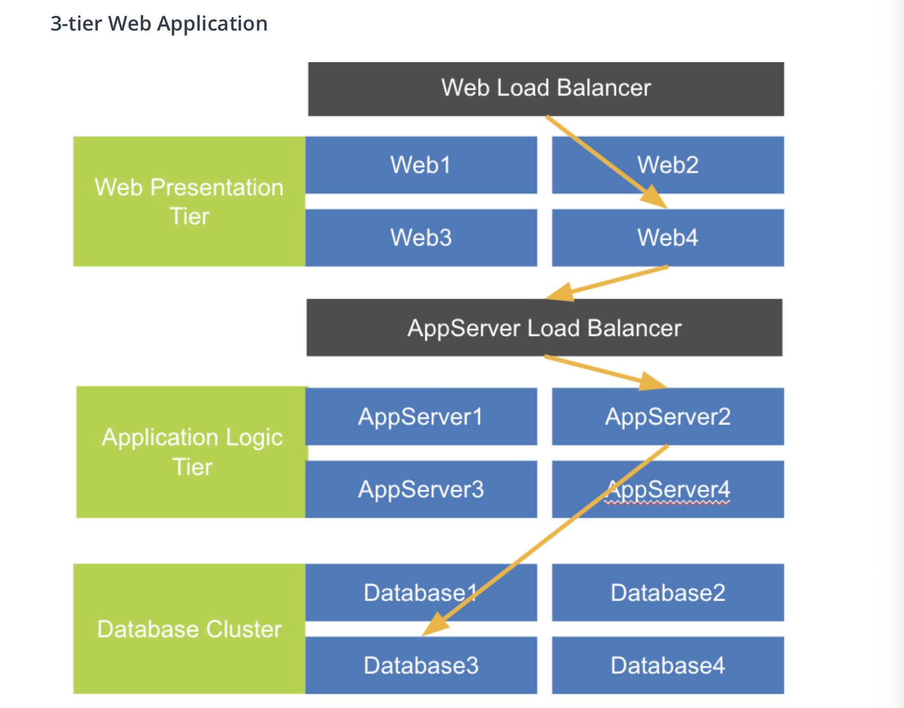

# Application Design: Distributed Web Scale 

The Internet and open source software lowered application design costs and changed to being distributed over the network. The functionality became a separation of duties from being monolithic.

You can easily see this was a typical three-tier web application, this includes:

1. The web presentation-tier using JavaScript, HTML, and CSS
2. The application logic tier using programming languages such as: Java, C++, Python, or Ruby
3. A database cluster for persistence.

By having every tier operate independently of the other tiers, this allows infinitely scaling out to accommodate demand. This can either be done by increasing or decreasing the population of the tier and distributing work in parallel.

Micro-service architecture with further separation of tier function allows application architecture to evolve towards network APIs based on the web, called RESTful APIs, or REST APIs.

Today’s cloud infrastructure is networked, which isn't like the single vendor's technology stack in monolithic architecture. When any individual member fails load balancers distribute each application tier's requests and maintain high availability. Every endpoint behind the load balancer can be hosted anywhere and mixed between different technologies which allows hybrid cloud mixing of IaaS , PaaS, and SaaS.

### 3-tier Web Application 

The Internet and open source software lowered application design costs and changed to being distributed over the network. The functionality became a separation of duties from being monolithic.

You can easily see this was a typical three-tier web application, this includes:

The web presentation-tier using JavaScript, HTML, and CSS
The application logic tier using programming languages such as: Java, C++, Python, or Ruby
A database cluster for persistence.
By having every tier operate independently of the other tiers, this allows infinitely scaling out to accommodate demand. This can either be done by increasing or decreasing the population of the tier and distributing work in parallel.

Micro-service architecture with further separation of tier function allows application architecture to evolve towards network APIs based on the web, called RESTful APIs, or REST APIs.

Today’s cloud infrastructure is networked, which isn't like the single vendor's technology stack in monolithic architecture. When any individual member fails load balancers distribute each application tier's requests and maintain high availability. Every endpoint behind the load balancer can be hosted anywhere and mixed between different technologies which allows hybrid cloud mixing of IaaS , PaaS, and SaaS.